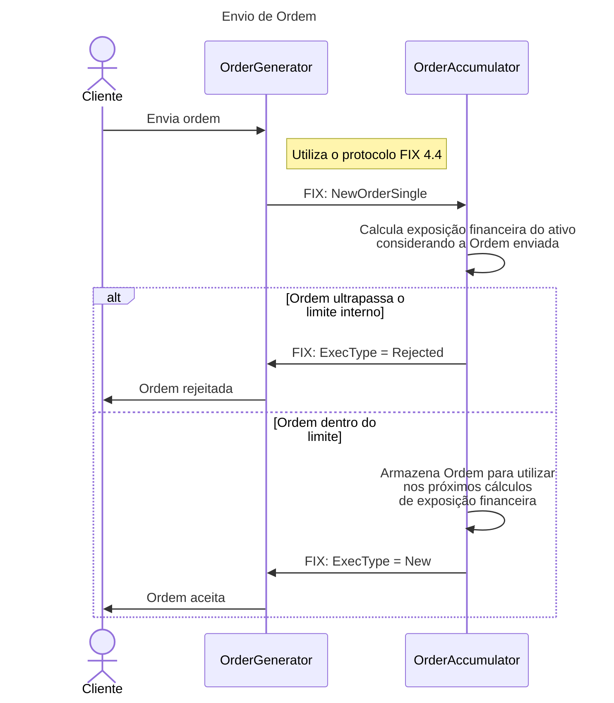

# financial-exposure

Este repositório contém a solução `FinancialExposure`, composta por três projetos:

- **`OrderGenerator`**: Serviço implementado em Blazor que contém a interface para envio de ordens.
- **`OrderAccumulator`**: Serviço utilizado para calcular a exposição financeira das ordens enviadas + API para acompanhamento de exposição financeira. 
- **`OrderAppHost`**: Serviço em .NET Aspire que contém ferramentas para gerir os serviços desta solução. 

## Dependências

Certifique-se de que as seguintes dependências estejam instaladas em sua máquina:

- [.NET 9 SDK](https://dotnet.microsoft.com/en-us/download/dotnet/9.0)


## Como executar na máquina local

1. Clone o repositório:

   ```bash
   git clone https://github.com/flavioalbuquerque/financial-exposure.git
   cd financial-exposure

2. Restaure as dependências do projeto:
```
dotnet restore
```

3. Execute o `OrderAppHost` para iniciar os serviços:
```
dotnet run --project src/OrderAppHost
```

## Como usar o Aspire no OrderAppHost
O `OrderAppHost` utiliza o Aspire para gerenciar os serviços desta solução. Aqui estão os passos para usar o Aspire:

1. Certifique-se de que o `OrderAppHost` está em execução:
```
dotnet run --project src/OrderAppHost
```

2. Acesse o painel do Aspire no navegador. Por padrão, ele estará disponível no seguinte endereço:
```
http://localhost:15219
```

3. No painel do Aspire, você pode:
- **Gerenciar serviços**: Iniciar, parar ou reiniciar os serviços da solução;
- **Monitorar logs**: Visualizar logs em tempo real;
- **Testar endpoints**: Usar ferramentas integradas para testar os endpoints da API.

## Como usar Swagger, Scalar e ReDoc
Swagger, Scalar e ReDoc estão configurados para o projeto `ÒrderAccumulator` nos seguintes endereços:
- **Swagger**: `http://localhost:5219/swagger`
- **Scalar**: `http://localhost:5219/scalar`
- **ReDoc**: `http://localhost:5219/redoc`

## Diagramas
Abaixo está o diagrama de sequência que ilustra o fluxo de envio de ordens:


