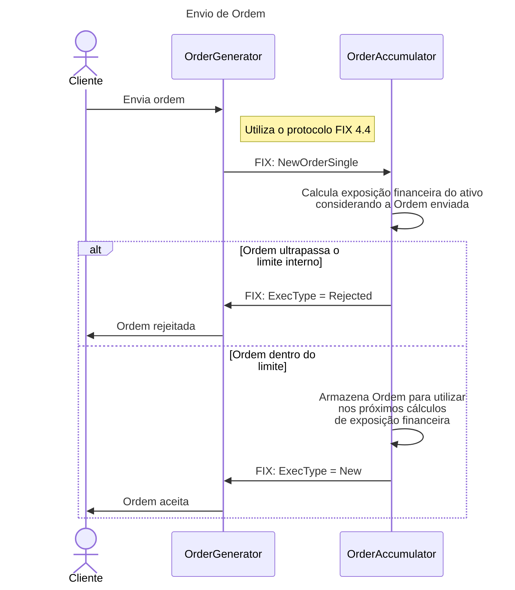

# financial-exposure

Este repositório contém 3 projetos:

- `OrderGenerator`: Serviço implementado em Blazor que contém a tela para envio de ordens
- `OrderAccumulator`: Long running service utilizado para calcular a exposição financeira das ordens enviadas
- `OrderAppHost`: Serviço em .Net Aspire que contém ferramentas para gerir os demais serviços

## Instruções para uso
Executar o `OrderAppHost`: `dotnet run --project src/OrderAppHost`

## Diagramas

