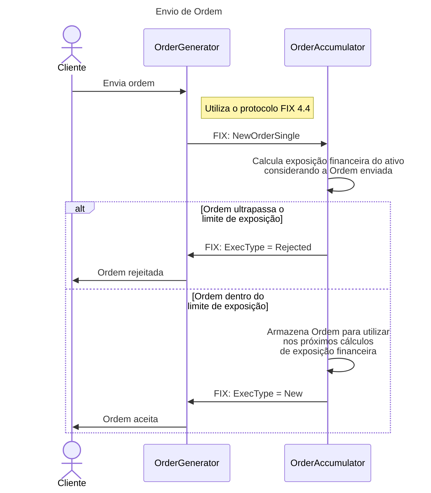

# financial-exposure

Este repositório contém a solução `FinancialExposure`, composta por três projetos:

- **`OrderGenerator`**: Serviço implementado em Blazor que contém a interface para envio de ordens.
- **`OrderAccumulator`**: Serviço utilizado para calcular a exposição financeira das ordens enviadas + API para acompanhamento de exposição financeira. 
- **`OrderAppHost`**: Serviço em .NET Aspire que contém ferramentas para gerir os serviços desta solução. 

## Dependências

Certifique-se de que as seguintes dependências estejam instaladas em sua máquina:

- [.NET 9 SDK](https://dotnet.microsoft.com/en-us/download/dotnet/9.0)


## Como executar na máquina local

1. Clone o repositório:

   ```bash
   git clone https://github.com/flavioalbuquerque/financial-exposure.git
   cd financial-exposure

2. Restaure as dependências do projeto:
```
dotnet restore src/FinancialExposure.sln
```

3. Execute o `OrderAppHost` para iniciar os serviços:
```
dotnet run --project src/OrderAppHost
```

## Como iniciar o orquestrador da solução
O `OrderAppHost` utiliza o Aspire para gerenciar os serviços desta solução. Aqui estão os passos para usar o Aspire:

1. Certifique-se de que o `OrderAppHost` está em execução:
```
dotnet run --project src/OrderAppHost
```

2. Acesse o painel do Aspire no navegador. Por padrão, ele estará disponível no seguinte endereço:
```
http://localhost:15219
```

3. No painel do Aspire, você pode:
- **Gerenciar serviços**: Iniciar, parar ou reiniciar os serviços da solução;
- **Monitorar logs**: Visualizar logs em tempo real;
- **Testar endpoints**: Usar ferramentas integradas para testar os endpoints da API.

## Testando a interface para envio de ordens
A interface `OrderGenerator` estará disponível no seguinte endereço:
```
https://localhost:7183
```


## Testando a API
A API do `OrderAccumulator` expõe documentação interativa através de:
- **Swagger**: 
  ```
  http://localhost:5219/swagger
  ```
- **Scalar**:
  ```
  http://localhost:5219/scalar
  ````
- **ReDoc**:
  ```
  http://localhost:5219/redoc
  ```

## Regras do serviço

### Regras
Ao receber uma nova ordem:
- O `OrderAccumulator` calcula a exposição financeira total;
- Se o envio ultrapassar o limite configurado, a ordem é rejeitada;
- Caso contrário, a ordem é aceita e armazenada para futuros cálculos.

### Diagramas
Abaixo está o diagrama de sequência que ilustra o fluxo de envio de ordens:



## Melhorias Futuras
Funcionalidades planejadas para as próximas versões da solução:

- [ ] **Correção na validação de ordens no frontend**  
  Corrigir validação para quantidade e preço acima de 999,00.

- [ ] **Implementar suporte completo a HTTPS**  
  Configurar os serviços para utilizar HTTPS por padrão, garantindo comunicação segura entre os componentes da solução.
  Inclui ajustes nas configurações de `applicationUrl` e a remoção da dependência da variável `ASPIRE_ALLOW_UNSECURED_TRANSPORT` para ambientes locais.

- [ ] **API OrderAccumulator: Desacoplar model do retorno da API**  
  Separar o modelo de domínio utilizado internamente (ex: entidade `Order`) dos modelos de resposta (DTOs) expostos pela API.

- [ ] **Dashboard de exposição agregada**  
  Interface visual para acompanhar a exposição financeira total em tempo real.

- [ ] **Dashboard de ordens**  
  Interface visual para acompanhar as ordens por símbolo.

- [ ] **Persistência em banco de dados**  
  Armazenar ordens em um banco relacional para análise posterior.

- [ ] **Testes automatizados**  
  Inclusão de testes unitários e de integração para garantir a estabilidade do sistema.

- [ ] **Integração com mensageria**  
  Substituir chamadas diretas por mensagens assíncronas, aumentando a escalabilidade.
  Esta melhoria também consiste em isolar o serviço `OrderGenerator` para que seja capaz de receber requisições de diferentes clients.

- [ ] **Suporte a múltiplos ativos e múltiplos clientes**  
  Separar cálculos de exposição por cliente e por ativo para maior granularidade.

